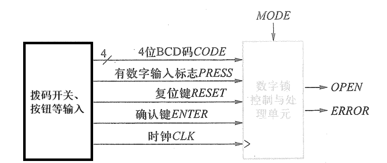
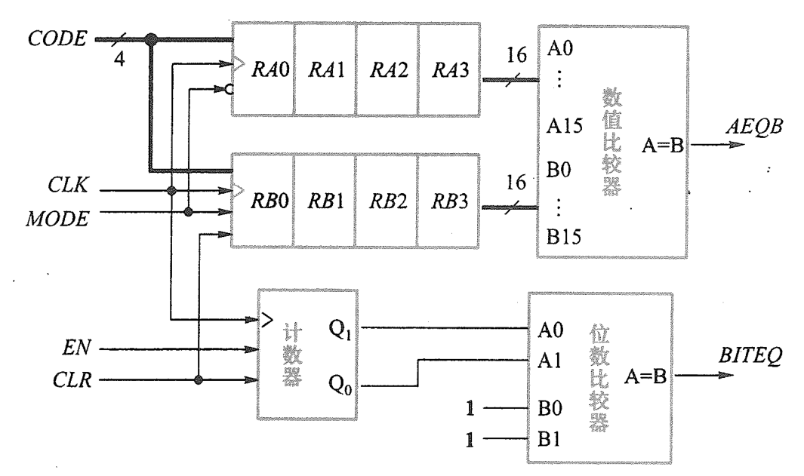
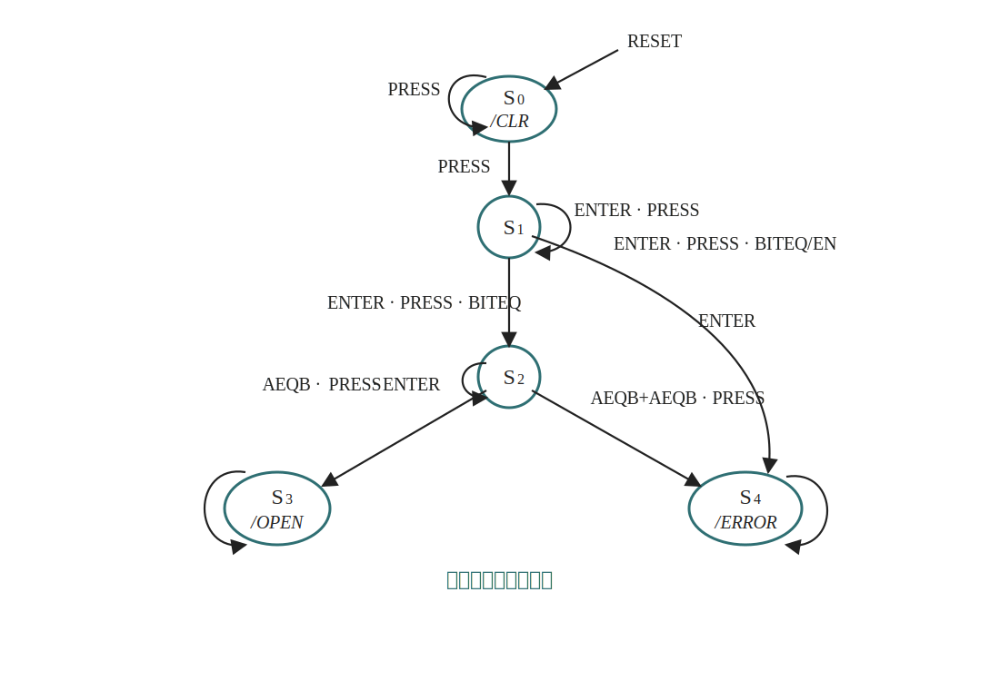
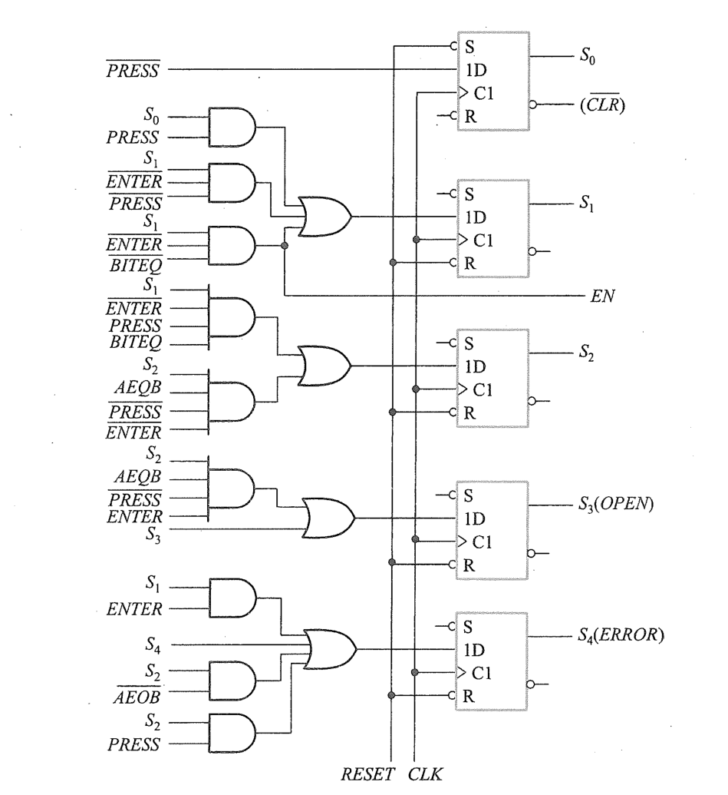
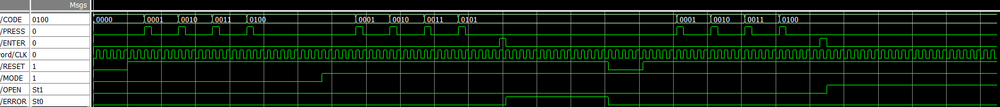

# 基于 Verilog 的可设定/可验证 4 位 BCD 密码锁设计报告（HNU 数电课程综合设计）

---

## 1. 课题背景与设计目标

本设计实现一个“数字密码锁”系统，支持：

- **4 位 BCD 密码**（每位 0~9，4bit 表示）
- **两种模式（MODE）**
  - `MODE=0`：设置密码（把输入依次写入保存寄存器）
  - `MODE=1`：解锁验证（把输入依次写入输入寄存器，并与保存密码比较）
- 基本交互信号（与图示一致）：
  - `CODE[3:0]`：当前输入数字的 BCD 码
  - `PRESS`：有效数字输入触发（按下确认“录入一位”）
  - `ENTER`：确认/提交（用于触发比较与输出）
  - `RESET`：复位
  - `CLK`：系统时钟
- 输出：
  - `OPEN`：开锁指示
  - `ERROR`：错误指示

---

## 2. 系统总体方案与结构划分

按照给出的设计思路/原理图（数据通路 + 控制器）实现，整体分为两层：

1. **可综合顶层（开发板适配层）**：`Lock_Top`（`lock_top.v`）
   - 完成与 DE2-115 外设对应的端口映射（拨码开关、按键、LED、数码管）
   - 对 `PRESS/ENTER` 做 **2 级同步 + 上升沿检测**，产生 1 个时钟周期宽度的脉冲（避免按住按键导致多次移位/多次计数）
   - 实例化核心密码锁模块 `Lock_Password`

2. **核心密码锁（功能层）**：`Lock_Password` 及其内部数据通路模块（在 `new_lock.v` 中）
   - 数据通路含：计数器、寄存器组、位数比较器、数值比较器
   - 控制器：根据 `RESET/PRESS/ENTER/MODE` 与比较结果 `BITEQ/AEQB` 产生使能与输出（与图示状态流程一致）

---

## 3. 关键接口信号说明（与原理图对应）

| 信号 | 位宽 | 方向 | 说明 |
|---|---:|---|---|
| `CLK` | 1 | in | 时钟（开发板为 50MHz） |
| `RESET` | 1 | in | 复位信号（工程中多处使用“低有效异步复位/清零”语义） |
| `MODE` | 1 | in | 模式：0=设密码，1=解锁 |
| `CODE` | 4 | in | 当前数字 BCD（0~9） |
| `PRESS` | 1 | in | 录入一位数字触发 |
| `ENTER` | 1 | in | 提交/确认触发 |
| `OPEN` | 1 | out | 通过验证开锁指示 |
| `ERROR` | 1 | out | 验证失败指示 |
| `BITEQ` | 1 | internal | 位数比较结果：是否已经输入满 4 位（计数到 3） |
| `AEQB` | 1 | internal | 数值比较结果：保存密码与输入密码是否相等 |

---

## 4. 数据通路（Datapath）设计
状态机

### 4.1 位数计数器 UPCount（2 位）

- 功能：记录已经输入了多少位（0~3）
- 计数在 `EN=1` 时随 `CLK` 上升沿递增
- 计数到 `3` 后保持（防止溢出）

`new_lock.v` 中实现要点（已读到的片段）：
- `always @(posedge CP or negedge CLR)`
- `if(!CLR) Q<=0`
- `else if(EN) Q<=Q+1`（到 3 停止）

### 4.2 4 位寄存器 Reg4（保存与输入）

- 每输入一位 BCD 数字，把 `CODE[3:0]` 锁存到对应寄存器
- 使用 4 组寄存器构成 4 位密码（每位 4bit，共 16bit）
- 在 `MODE=0`（设密码）时写入 **保存寄存器组 RA0~RA3**
- 在 `MODE=1`（解锁）时写入 **输入寄存器组 RB0~RB3**

寄存器采用异步清零端 `CLR`（低有效）：
- `always @(posedge CP or negedge CLR)`
- `if(!CLR) Q<=0`
- `else if(LD) Q<=Pdata`

### 4.3 位数比较（BITEQ）

- 将计数器输出 `CNT[1:0]` 与常量 `2'b11`（即 4 位输入完成）比较
- `BITEQ=1` 表示已输入 4 位（计数到 3）

### 4.4 数值比较 Comparator16（AEQB）

- 将保存密码 `SAVE_PWD[15:0]` 与输入密码 `INPUT_PWD[15:0]` 比较
- `AEQB=1` 表示两者相等

在 `new_lock.v` 中实现为组合比较器：
- `always @(*) if(A==B) EQU=1 else 0`

---

## 5. 控制器（Controller / FSM）设计

### 5.1 控制核心思想

- `PRESS`：表示用户“确认录入当前 CODE”，控制器据此产生：
  - 寄存器加载使能（把当前 CODE 写入当前位）
  - 计数器使能（位数 +1）
- `ENTER`：表示用户“输入结束，进行处理/比较”
- `BITEQ`：用于判断是否已输入满 4 位（否则不允许进入比较/判决）
- `AEQB`：用于最终判决（相等则 OPEN，否则 ERROR）

### 5.2 典型时序过程（与 tb 对应）

1. `RESET` 复位清零（计数器与相关寄存器）
2. `MODE=0` 设密码：依次输入 4 次 `PRESS`（例如 1、2、3、4）
3. `MODE=1` 解锁：再次输入 4 次 `PRESS`（例如 1、2、3、5）
4. `ENTER` 提交：
   - 若 `AEQB=1` -> `OPEN=1`
   - 否则 `ERROR=1`

---

## 6. FPGA 顶层适配与人机交互设计（lock_top.v）

### 6.1 按键同步与“单脉冲化”的必要性

README 与 `lock_top.v` 代码强调：**必须做上升沿检测**。原因：

- 板载按键按下持续时间远大于时钟周期（50MHz -> 20ns）
- 若直接用按键电平作为 `LD/EN`，按住一次会跨越多个时钟沿，导致**一次按键触发多次移位/多次计数**，密码被写乱

### 6.2 实现方式（已读到片段）

- 先将板载 KEY 的低有效信号取反得到“按下=1”
- 做 2 级同步触发器
- 用 `sync & ~sync_d` 产生单周期脉冲：
  - `enter_pulse`
  - `press_pulse`

---

## 7. 仿真验证（tb_new_lock.v）

`tb_new_lock.v` 中给出一个简化测试流程：

- 时钟：周期 20ns（#10 翻转）
- 流程：
  1) 复位  
  2) `MODE=0` 输入 1234（每次 `PRESS` 拉高 20ns）  
  3) `MODE=1` 输入错误密码 1235  
  4) （后续应包含 `ENTER` 触发与结果观察）

仿真关注点：
- 每次 `PRESS` 的单次触发是否只写入一位
- `BITEQ` 在第 4 位之后是否为 1
- `ENTER` 后 `OPEN/ERROR` 输出是否正确
- `RESET` 后寄存器/计数器是否回到初始态

---

## 8. 复位策略与模式相关清零（工程特色）

README 描述并在 `new_lock.v` 中体现的关键点：

- 复位有效：`RESET=0`（与异步清零端 `CLR` 低有效一致）
- 为避免在解锁模式误清“已保存密码”，采取 **按 MODE 区分清零对象**：
  - `MODE=0`：复位清保存寄存器（RA 组）
  - `MODE=1`：复位清输入寄存器（RB 组）
- 数据通路内生成两路清零（README 示例）：
  - `clr_save  = RESET | MODE`
  - `clr_input = RESET | ~MODE`

---

## 9. 引脚分配与下载说明（DE2-115）

README 给出了 Quartus 工程结构与引脚分配脚本（`quartus_compile/lock_pins.tcl`），关键端口映射（节选）：

- `CLK` -> `CLOCK_50`
- `RESET/ENTER/PRESS` -> `KEY[0..2]`
- `MODE` -> `SW[0]`
- `CODE[3:0]` -> `SW[4:1]`
- `OPEN/ERROR` -> LED 指示灯
- 数码管 HEX（共阳，低电平点亮）可按 README 分配到 `HEX0[6:0]` 等引脚

下载流程：
1. Quartus 重新编译
2. 可执行 tcl 脚本完成引脚约束
3. 下载 `.sof` 至 FPGA，按键 + 拨码开关交互验证

---

## 10. 总结与可扩展方向

本工程按“控制器 + 数据通路”的经典数电/可综合设计方法完成了 4 位 BCD 密码锁，并补充了工程化细节：

- 按键同步与单脉冲处理（解决真实硬件与仿真差异）
- MODE 相关的复位保护策略（避免清掉保存密码）
- 数码管显示扩展（便于演示与调试）

可扩展方向：
- 增加错误次数限制与锁定计时
- 增加密码长度可配置（例如 6 位或可变长度）
- 增加“ENTER 前必须满 4 位有效输入”的强约束与提示状态

---

## 参考资料与链接

- 仓库主页：<https://github.com/AndyXie0718/Verilog_Learning>
- README（工程结构/引脚/顶层说明）：<https://github.com/AndyXie0718/Verilog_Learning/blob/main/README.md>
- 顶层文件：<https://github.com/AndyXie0718/Verilog_Learning/blob/main/lock_top.v>
- 核心逻辑：<https://github.com/AndyXie0718/Verilog_Learning/blob/main/new_lock.v>
- 仿真文件：<https://github.com/AndyXie0718/Verilog_Learning/blob/main/tb_new_lock.v>
